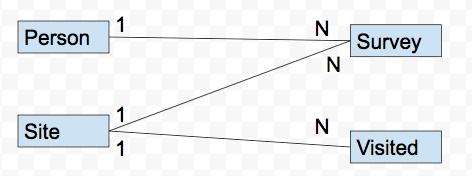

Exercício baseado em http://swcarpentry.github.io/

Crie um banco de dados com as tabelas a seguir:

  

Para cada tabela crie os seguinte atributos

**Person: pessoa que realiza leituras** 

* id : identificação única	
* personal	: primeiro nome
* family : sobrenome

Exemplo de instâncias:

|id	|personal	|family|
|----------|:-------------:|------:|
dyer	| William	| Dyer|
pb	| Frank	| Pabodie |

**Site: localizações onde leituras foram realizadas** 

* name : nome do lugar	
* lat	 : latitude
* long : longitude

Exemplo de instâncias:
 
|name|	lat|	long|
|----------|:-------------:|------:|
|DR-1	|-49.85	|-128.57
|DR-3|	-47.15|	-126.72

**Visited: quando as leituras foram realizadas** 

* id : identificação única	
* site	: site visitado
* date : data da visita

Exemplo de instâncias:

|id	|site|	dated|
|----------|:-------------:|------:|
|619	|DR-1	|1927-02-08 |
|622	|DR-1	|1927-02-10 |

**Survey: leituras realizadas** 

* taken	: idenficação do site
* person	: id da pessoa que esta realizando a coleta 
* quant	 : quantitativo e indicativo do que está sendo medido. Valores possíveis rad, sal, and temp que referem-se a ‘Radiação’, ‘salinidade’ e ‘temperatura’
* reading : leitura 

Exemplo de instâncias:

|taken|	person	|quant|	reading|
|----------|:-------------:|------:|------:|
|619|	dyer|	rad|	9.82 |
|619	|dyer	|sal	|0.13 |
|622	|dyer|	rad	|7.8 |
